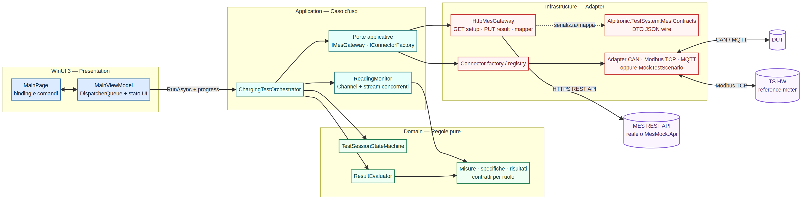
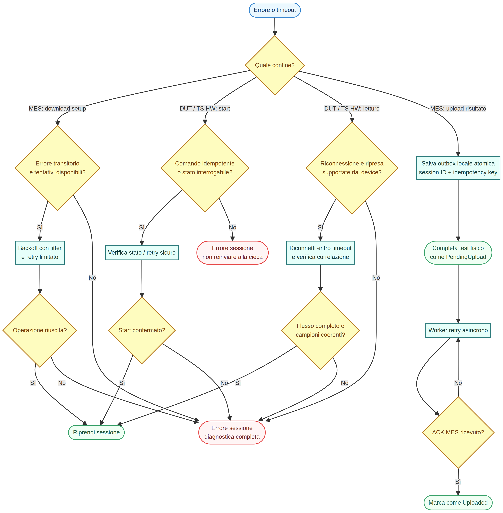

# Decisioni architetturali e revisione critica della proposta iniziale

La proposta iniziale è una buona base, ma non è stata adottata passivamente. Il case study richiede una UI **WinUI**, aggiornamenti live asincroni, resilienza e l'aggiunta di DUT/TS HW differenti con modifiche minime. Le decisioni sotto sono orientate a questi vincoli.

> Per il razionale operativo delle scelte presentate, consultare la [wiki interna](wiki/README.md).

| Proposta iniziale | Decisione adottata | Perché |
|---|---|---|
| WPF + MVVM | **WinUI 3 + MVVM** | Il brief richiede espressamente WinUI. MVVM resta utile per isolare View XAML, stato della UI e caso d'uso. |
| View per la grafica | **Confermata, con un vincolo**: la View non contiene logica di sessione; il ViewModel espone binding e comandi | Riduce code-behind, semplifica il test e mantiene la UI reattiva. |
| Model per test e procedure | **Diviso in Domain e Application** | Le entità/regole PASS-FAIL sono pure e testabili nel Domain. La procedura di sessione apre connessioni, fa retry e upload: è un caso d'uso Application, non un Model. |
| Namespace DTO per MES/API | **Confermato, confinato in Infrastructure** | I DTO rappresentano JSON/HTTP esterni. Se entrassero nel Domain, una modifica di API contaminerebbe le regole di business. Il mapper è il confine esplicito. |
| Un `IConnector` + factory/DI per Modbus/CAN/MQTT | **`IConnector` base più contratti per ruolo, factory come porta DI** | Il DUT e il banco hanno capacità diverse. Un mega-contratto imporrebbe metodi senza senso agli adapter. La factory seleziona modello/trasporto, ma l'orchestratore conosce solo ruoli. |
| `Mock[scope]` per use case | **`MockTestScenario` parametrico + mock per confine** | Una classe per ogni scenario scala male. Parametri riproducono mismatch, timeout e interruzioni e rendono i test leggibili. |
| Test almeno sul connector | **Test del dominio, state machine, adapter mock e orchestratore** | Il rischio non è solo il connettore: pass/fail, transizioni, correlazione campioni e upload sono parti critiche richieste dal brief. |

## Strati e responsabilità

Il flowchart seguente evidenzia il verso delle dipendenze e il punto in cui vivono gli adapter concreti.



Sorgente modificabile: [`architecture-overview.mmd`](diagrams/architecture-overview.mmd).

```text
WinUI 3
  └─ View / ViewModel: binding, comandi, DispatcherQueue
Localization
  └─ ITranslationService + IDataProvider: JSON oggi, database domani
Application
  └─ ChargingTestOrchestrator: scarica setup, coordina, monitora, valuta, carica
Domain
  └─ Measurement, TestSpecification, state machine, ResultEvaluator, contratti
Infrastructure
  └─ HTTP MES, DTO/mapper, retry, CAN/Modbus/MQTT adapter, mock
```

La separazione non è “clean architecture” ornamentale: consente di eseguire i test unitari su Linux/CI senza avviare WinUI, hardware CAN/Modbus o MES, e di sostituire mock/adapters senza riscrivere il caso d'uso.

## Connettori: scelta dettagliata

```csharp
public interface IConnector : IAsyncDisposable
{
    Task ConnectAsync(CancellationToken ct);
    Task DisconnectAsync(CancellationToken ct);
}

public interface IDutConnector : IConnector
{
    Task StartChargingAsync(ChargeStartCommand command, CancellationToken ct);
    IAsyncEnumerable<MeterReading> ReadDeclaredMeterAsync(...);
}

public interface ITestSystemHardwareConnector : IConnector
{
    Task StartMonitoringAsync(ChargeStartCommand command, CancellationToken ct);
    IAsyncEnumerable<MeterReading> ReadReferenceMeterAsync(...);
}
```

La factory è appropriata **al bordo** per trasformare `ConnectorSelection` (modello, trasporto, impostazioni) nell'adapter corretto. Nella reale composition root preferirei DI per costruire gli adapter e una `IConnectorFactory`/registry per la selezione runtime. Questo evita `switch` sparsi e permette test con fake.

Non introdurrei subito una gerarchia comune `CanConnector`, `ModbusConnector`, `MqttConnector`: il trasporto è un dettaglio, mentre il caso d'uso dipende dalle capacità. Per esempio, due DUT CAN diversi possono esporre frame e policy di reconnect differenti, pur implementando lo stesso `IDutConnector`.

## Aggiornamenti live e consistenza

Il ViewModel non effettua polling. L'Application riceve due stream asincroni, li convoglia in un `Channel` e pubblica `SessionUpdate`; il ViewModel inoltra sul `DispatcherQueue` WinUI. Il core non usa tipi UI.

Per qualsiasi valore della curva è rischioso confrontare due campioni generici. Lo skeleton richiede stesso `Sequence` e insieme completo di sequence per entrambe le fonti; Power ed Energy sono verificate su ogni coppia e una sola violazione genera FAIL. In un banco reale sceglierei inoltre un protocollo di correlazione o un massimo skew temporale documentato. Se questo non è dimostrabile, l'esito deve essere `Error`/`Inconclusive`, non PASS né FAIL.

## Resilienza deliberatamente non nascosta

Il retry generico nello skeleton è didattico. In produzione distinguerei:



Sorgente modificabile: [`failure-recovery.mmd`](diagrams/failure-recovery.mmd).

- **download setup:** retry per timeout/HTTP 5xx, con limite;
- **start comando:** retry soltanto se il protocollo offre un ID comando idempotente; altrimenti query dello stato prima di reinviare;
- **letture:** breve reconnect/ripresa se supportato dal device, altrimenti sessione in errore;
- **upload MES:** outbox locale persistente, idempotency key e stato `PendingUpload`.

Questa scelta protegge la tracciabilità: un test fisicamente completato non viene perso solo perché il MES è temporaneamente irraggiungibile.

## Scelte non fatte ora

- **Event aggregator globale:** evitato; nasconde il flusso e rende più difficili ordine, cancellazione e test.
- **Singleton dei connettori:** evitato; connessioni e stato devono vivere quanto una sessione, con teardown deterministico.
- **Business logic nel ViewModel:** evitata; renderebbe i test dipendenti dal dispatcher WinUI.
- **Un database locale completo:** non necessario al partial implementation; l'outbox è la prima persistenza con valore reale da introdurre.

## Assunzioni

1. Il MES fornisce tolleranze, durata e configurazione per un seriale validato.
2. Ogni workstation gestisce una sola sessione alla volta; i banchi condivisi richiedono lock/lease.
3. Power è kW ed energy è kWh, nella stessa convenzione per DUT e meter indipendente.
4. I mock simulano il comportamento, non sostituiscono test d'integrazione su protocollo/hardware reale.
