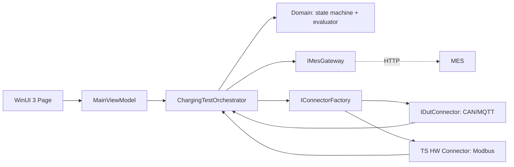

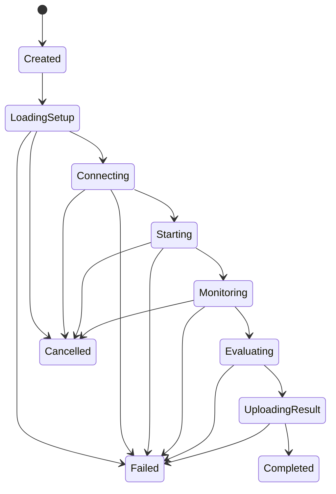

# Design rationale — Test System App

## Architettura proposta



Versione renderizzata per consultazione rapida:


Sorgente modificabile: [`architecture-overview.mmd`](diagrams/architecture-overview.mmd).

La dipendenza punta verso il centro: WinUI 3 e Infrastructure dipendono da Application/Domain, mai viceversa. Il risultato è che la logica di valutazione è testabile senza Windows, rete o hardware.

## Mappatura alle aree richieste

| Area del case study | Implementazione nello scheletro | Evoluzione consigliata |
|---|---|---|
| Data modelling | `MeterReading`, `TestSpecification`, `FinalReadings`, `SessionResult` | Definire unità SI complete e versionare i contratti di misura. |
| Protocollo/interfacce | `IConnector`, `IDutConnector`, `ITestSystemHardwareConnector`, `IMesGateway` | Adapter CAN/Modbus/MQTT senza cambiare l'orchestratore. |
| Resilienza | `CancellationToken`, `ExponentialBackoffRetryPolicy`, gestione `Error`/`Cancelled` | Retry condizionato, circuit breaker, outbox per l'upload. |
| Consistenza risultati | `ReadingMonitor` correla tutte le `Sequence`; `ResultEvaluator` verifica Power/Energy su ogni coppia | Aggiungere massimo skew temporale e controlli qualità sulla curva. |
| Estendibilità | `ConnectorSelection` e `IConnectorFactory` | Registry per modello/versione firmware e capability discovery. |
| UI responsiva | WinUI 3, `DispatcherQueue`, `Progress<SessionUpdate>` e `AsyncRelayCommand` | Virtualizzazione log, grafico live limitato, stato connessioni. |
| Diagnostica | `ISessionLogger`, messaggi di stato, eccezioni preservate | Log strutturati con correlation ID e storage centralizzato. |

## Perché non un unico `IConnector`?

Un unico contratto con `StartCharge`, `ReadDutMeter`, `ReadLoadMeter`, `UploadResult` mescola ruoli e porta ogni implementazione a contenere metodi inutili. La proposta conserva l'idea di una base comune:

```csharp
public interface IConnector : IAsyncDisposable
{
    Task ConnectAsync(CancellationToken ct);
    Task DisconnectAsync(CancellationToken ct);
}
```

ma aggiunge contratti specifici del ruolo. Un adapter CAN del DUT implementa `IDutConnector`; un contatore Modbus implementa `ITestSystemHardwareConnector`. La factory sceglie gli adapter in base al setup MES. Il caso d'uso dipende dai contratti, quindi l'aggiunta di un nuovo modello richiede solo un nuovo adapter/registrazione.

## Concorrente, ma deterministico

I due dispositivi producono flussi autonomi. `ReadingMonitor` avvia due producer, li fa convergere in un `Channel` e il consumatore pubblica lo snapshot più recente. Non viene effettuato polling dalla UI.

### Flowchart del ciclo di sessione



Sorgente modificabile: [`session-lifecycle.mmd`](diagrams/session-lifecycle.mmd).

Per ogni **risultato campionato** non basta prendere due valori qualsiasi: lo scheletro richiede lo stesso `Sequence` e lo stesso insieme di sequence dai due stream. La regola PASS/FAIL controlla Power ed Energy per tutte le coppie e una sola violazione rende la sessione FAIL; l'ultimo campione viene conservato solo come snapshot finale compatibile con la UI.

Se l'hardware non offre una sequenza condivisa, definire esplicitamente una politica, per esempio:

- timestamp normalizzati e skew massimo di 250 ms;
- una barriera di fine test inviata ad entrambi gli endpoint;
- set di campioni richiesto con identificativi di acquisizione correlabili;
- errore `Inconclusive` se non è dimostrabile la correlazione.

## Stati e failure policy



Una transizione non valida lancia eccezione: evita di caricare un risultato non valutato. In un progetto reale terrei anche il timestamp e la causa di ogni transizione per il report diagnostico.

## Confine MES, REST e upload affidabile

`HttpMesGateway` è l'unico adapter client che conosce URI e JSON. Il case study richiede alla TS App di chiamare il MES via API, perciò lo skeleton definisce e testa il seguente contratto: `GET /api/test-sessions/{serialNumber}/setup` e `PUT /api/test-sessions/{sessionId}/result`. Il secondo usa `PUT` perché `SessionId` è già noto e la ripetizione della stessa richiesta è idempotente.

`Alpitronic.TestSystem.MesMock.Api` espone le stesse risorse come Minimal API locale: non è una falsa pretesa di implementare il MES, ma una dimostrazione end-to-end del client e del wire contract. Il dettaglio è in [contratto REST MES](mes-rest-api.md). L'upload sincrono conclude la sessione demo; in produzione la strategia preferibile è:

1. generare `sessionId` e idempotency key prima del test;
2. salvare risultato e payload in un'**outbox locale transazionale**;
3. tentare l'upload;
4. marcare la riga come inviata solo dopo ACK MES;
5. riprendere outbox al riavvio e rendere il risultato “pending upload” distinguibile in UI.

Questo protegge la tracciabilità quando DUT/TS HW hanno finito correttamente ma il MES è momentaneamente non disponibile.

## Assunzioni esplicite

1. Il MES restituisce durata, intervallo e tolleranze validi per il seriale richiesto.
2. Il test è singola sessione per workstation; parallelizzare unità diverse richiede un lock/lease di banco.
3. Power è in kW ed energy in kWh; entrambi i meter usano la stessa convenzione e reset di sessione.
4. Il test valuta ogni campione correlato della curva per Power ed Energy; un'evoluzione reale può aggiungere min/max/ripple, skew temporale e regole specifiche di procedura.
5. Il seriale non viene considerato dato segreto, ma log/endpoint non devono contenere credenziali o token.
6. La soglia è percentuale rispetto al meter indipendente; il caso 0 kWh/0 kW è gestito in modo esplicito.
7. Poiché il brief richiede una connessione al MES via API ma non prescrive il protocollo, lo skeleton assume HTTP/JSON REST con contratti versionabili e risultato idempotente via `PUT`.

## Traccia per una presentazione da 20–30 minuti

1. Contesto e flusso operatore/MES/DUT/TS HW (2 min)
2. Confini e struttura dei quattro progetti (4 min)
3. Demo UI e flusso async live (4 min)
4. Stato, concorrenza e consistenza dei campioni (5 min)
5. Contratti e aggiunta adapter CAN/Modbus/MQTT (4 min)
6. Failure handling, retry/outbox, diagnosi (5 min)
7. Test unitari, trade-off e prossimi step (4 min)
