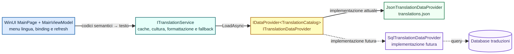

# Gestione delle traduzioni

## Decisione architetturale

Le traduzioni non appartengono né al Domain né all'Application layer. Il core emette **codici semantici** (`SessionMessageCode`, `TestSessionState`, `TestOutcome`); il layer WinUI risolve quei codici in testo tramite `ITranslationService`.



Sorgente modificabile: [`localization-provider-flow.mmd`](diagrams/localization-provider-flow.mmd).

```text
WinUI ViewModel
  -> ITranslationService
     -> ITranslationDataProvider : IDataProvider<TranslationCatalog>
        -> JsonTranslationDataProvider (ora)
        -> SqlTranslationDataProvider / API provider (futuro)
```

Questa separazione impedisce che il core contenga frasi in una lingua specifica e permette di passare dal file al database senza cambiare binding, ViewModel o orchestratore.

## Contratti

```csharp
public interface IDataProvider<TData>
{
    Task<TData> LoadAsync(CancellationToken cancellationToken);
}

public interface ITranslationDataProvider : IDataProvider<TranslationCatalog> { }

public interface ITranslationService
{
    IReadOnlyList<SupportedLanguage> SupportedLanguages { get; }
    SupportedLanguage CurrentLanguage { get; }
    Task InitializeAsync(CancellationToken cancellationToken);
    void SetLanguage(string languageCode);
    string Translate(TranslationKey key, params object?[] arguments);
}
```

`ITranslationService` è l'unica dipendenza del ViewModel. `ITranslationDataProvider` è l'unica dipendenza del servizio dalla persistenza.

## Provider attuale: JSON

Il catalogo è [`src/Alpitronic.TestSystem.WinUI/Assets/translations.json`](../src/Alpitronic.TestSystem.WinUI/Assets/translations.json) e contiene quattro lingue iniziali:

| Codice | Lingua nel menu | CultureInfo | Scopo |
|---|---|---|---|
| `it-IT` | Italiano | `it-IT` | Lingua predefinita |
| `en-US` | English | `en-US` | Interfaccia internazionale |
| `de-DE` | Deutsch | `de-DE` | Esempio di formattazione decimale con virgola |
| `ja-JP` | 日本語 | `ja-JP` | Verifica Unicode e caratteri non latini |

Il JSON contiene tutte le `TranslationKey` per ogni lingua. `TranslationService.InitializeAsync` valida il catalogo in modo fail-fast: un testo mancante non raggiunge l'operatore in forma parzialmente localizzata.

## Comportamento UI

- Il menu a tendina è collegato a `SupportedLanguages` e `SelectedLanguage`.
- Al cambio lingua, `LanguageChanged` aggiorna titolo finestra, etichette, comandi, stati, esiti, misure e righe di diagnostica già mostrate.
- Le quantità sono formattate usando la `CultureInfo` della lingua selezionata.
- I dettagli tecnici provenienti da un device o da un'eccezione esterna non vengono tradotti artificialmente: sono inseriti nel messaggio localizzato come dettaglio diagnostico e restano fedeli alla sorgente.

## Migrazione a database

La migrazione non cambia `ITranslationService` né `MainViewModel`. Si aggiunge un provider che implementa `ITranslationDataProvider`:

```csharp
public sealed class SqlTranslationDataProvider : ITranslationDataProvider
{
    public Task<TranslationCatalog> LoadAsync(CancellationToken cancellationToken)
    {
        // Query Language e TranslationEntry; costruisce TranslationCatalog.
    }
}
```

Schema relazionale minimo consigliato:

| Tabella | Chiave | Campi principali |
|---|---|---|
| `Language` | `LanguageCode` | `CultureName`, `DisplayName`, `IsDefault`, `IsEnabled` |
| `TranslationKey` | `Key` | `Description`, `Module`, `IsActive` |
| `TranslationEntry` | `LanguageCode`, `Key` | `Text`, `UpdatedAtUtc`, `Version`, `UpdatedBy` |

### Vincoli operativi per il database

1. Vincolo univoco su `(LanguageCode, Key)`.
2. Foreign key di `TranslationEntry` verso `Language` e `TranslationKey`.
3. Versionamento/audit per risalire a quale traduzione ha visto un operatore.
4. Cache locale con versione del catalogo, perché il banco non deve bloccarsi se il servizio centrale è irraggiungibile.
5. Pubblicazione atomica di un catalogo completo: mai mescolare chiavi di versioni diverse durante una sessione.

> In produzione il JSON può rimanere come fallback read-only bootstrap; il provider database diventa la sorgente primaria e il servizio mantiene la stessa API.
